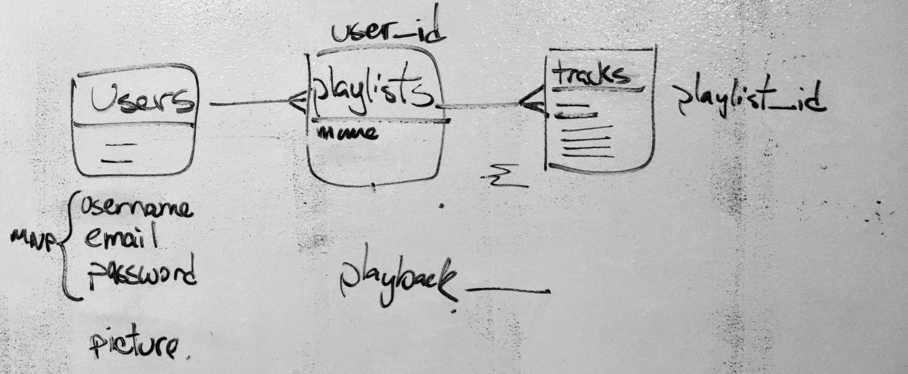
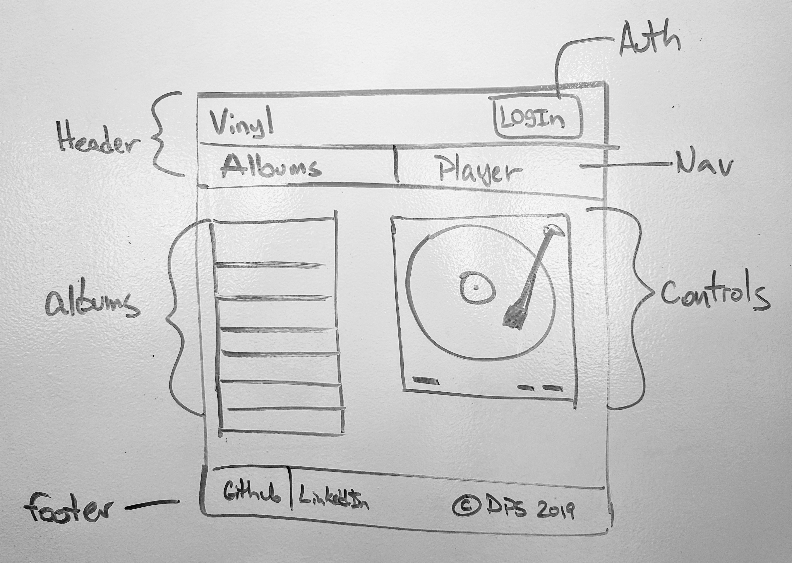
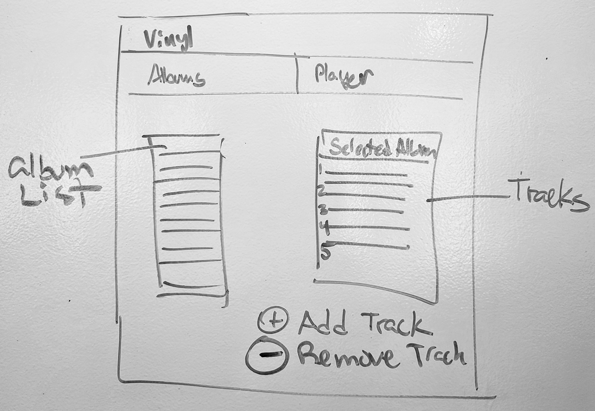

# **Vinyl**

`www.vinyl.music/player`

## Introduction to your app (description)

Users user music players that provide them with all the options and capabilities that the modern web has to provide. Vinyl does not. It's purpose is to recreate the UX of listening to music on a record player or turntable.

## Feature List (user stories)

- User can create a Playlist/Album/Set
- User can add tracks to Playlist/Album/Set
- User can remove tracks to Playlist/Album/Set
- User can order tracks in Playlist/Album/Set
- User can play Full Playlist/Album/Set but not individual tracks
- User can _scroll_ through Playlist/Album/Set

## Technologies to be used

- Rails
- React
- PostgreSQL
- Axios
- Bcrypt
- Knock
- JsonWebToken (JWT)
- React Bootstrap
- Amazon Web Services
- React-Sound

## ERD (images included in the proposal)

## Wireframes (images included in the proposal)

## M.V.P

- [X] Register
- [X] Login
- [ ] Create Playlist/Album/Set
- [ ] Upload Tracks to Playlist/Album/Set
- [ ] Edit Track order in Playlist/Album/Set
- [ ] Delete Tracks from Playlist/Album/Set
- [ ] Play/Pause/Stop Playlist/Album/Set

## Post M.V.P features

- [] 
- []
- []

## Code example with description

`console.log('hello world!)`

## Installation instructions (at the top of the README)

- `git clone http://github.com/darwin911/vinyl`
- `bundle install`
- `cd client`
- `npm i`

> https://medium.com/@fabianopb/upload-files-with-node-and-react-to-aws-s3-in-3-steps-fdaa8581f2bd